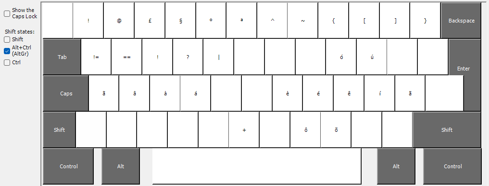

# LEA Keyboard Layout

The **LEA Keyboard Layout** is a modified keyboard layout inspired by **Oxey Strdy** and optimized for **Vim users** on **EU ISO keyboards**. 

## Table of Contents

- [Background](#background)
- [Features](#features)
- [Key Layout](#key-layout)
- [Vim Key Modifications](#vim-key-modifications)

## Background

The LEA Keyboard Layout is the result of experimenting with various layouts, including:

- **Colemak**: A significant improvement over QWERTY, but it sparked a search for an even more efficient layout.
- **Colemak-DH** (and other Colemak variants): Offered slight improvements, but some key placements, like **F**, **Y**, and **A**, could be further optimized.
- **Canary**: A fast and comfortable layout with **T** in a strong position and **A** on the right hand. However, **Y** and **V** placements weren’t ideal for English and Portuguese typing needs.
- **STRDY**: A highly efficient layout that could be the standard for English typing. However, **T** on the ring finger takes some adjustment.

## Modified Strdy - LEA Keyboard

### Key Modifications
- **M**: Moved to the right side. While this slightly increases the load on the right hand, it improves typing rolls, stabilizes the left hand, and facilitates combinations like "MAKE" (where **M** and **K** are close).
- **Q**: Moved back to the left hand. Common in Portuguese, **Q** also benefits English typing with this placement.
- **V**: Positioned for easy access and improved comfort.
- **J**: Optionally placed to the left of **F** to accommodate **Ç** for Portuguese typists (optional for English-only users).

## Key Layout

Here are images of the LEA Keyboard Layout in different modes:

- **Normal** mode:
  
  
- **Shift** mode:
  
  
- **AltGr** mode:
  

## Vim Key Modifications

### Navigation Keys
- **B**: Left movement
- **N**: Down movement
- **E**: Up movement
- **I**: Right movement

### Other Key Remappings
- **L**: "Let" replaces **I** (insert mode)
- **K**: "Bookmark" replaces **M** (mark)
- **J**: Replaces **O**
- **M**: "Minus" replaces **B**
- **O**: Replaces **E**
- **H**: "Hop" replaces **N**

## Positive Aspects of the Layout
- **V** for visual mode is in an optimal position.
- **Y** and **P** are conveniently located next to each other.
- **D** is in an excellent position.
- **A** is in the perfect position for easy access.
- **,** (comma) is ideally placed.
- **S** and **T** are on the home row and in great positions.
- **O** is positioned on the right middle finger for easy reach.
